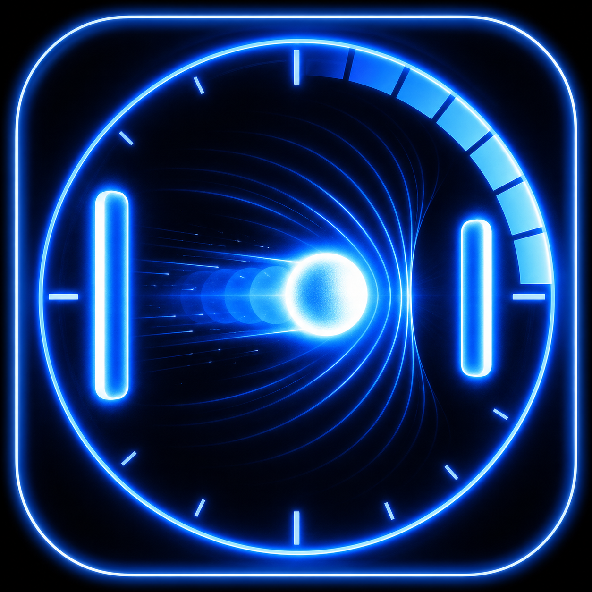
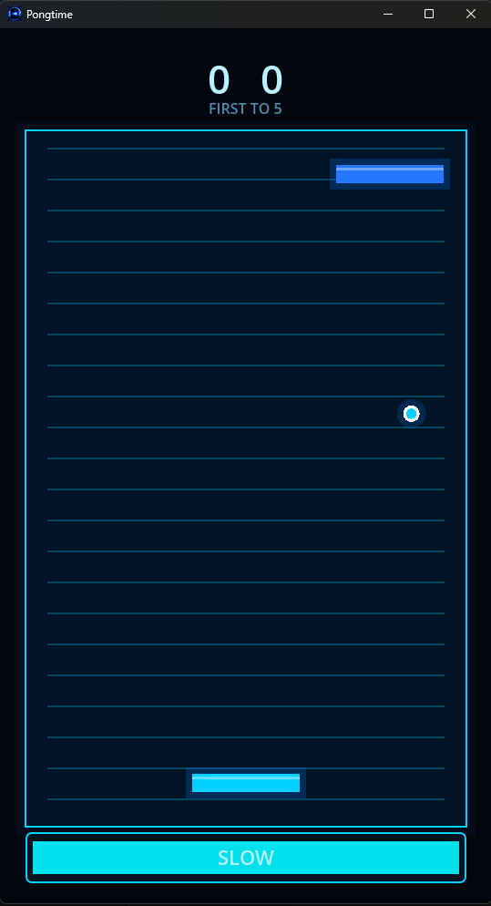

# Pongtime



Pongtime is a small portrait-first Pong game made in Godot 4.6 with C#. It keeps the old arcade idea simple, then twists it a little: you play from the bottom of a tall neon-blue court, and you can briefly slow time to turn a rough rally back in your favor.



## What It Is

This is classic Pong rotated into a 9:16 playfield. The player paddle sits at the bottom, the CPU waits at the top, and matches run first to 5. The ball speeds up as rallies go on, so the early taps feel clean and the late ones get wonderfully tense.

The main extra move is the slow-time ability. When it is ready, trigger it to slow the ball and CPU paddle for a couple seconds while your paddle stays responsive. It is short, readable, and has a cooldown, so it feels more like a well-timed clutch button than a cheat code.

## Controls

- Move: `Left` / `Right`, `A` / `D`, or drag with mouse/touch
- Slow time: `Space` or the on-screen `SLOW` button
- Goal: reach 5 points before the CPU

## Built With

- Godot 4.6
- C# / .NET
- A 540x960 virtual layout that scales to different window sizes
- Menu, gameplay, and results screens
- Original neon-blue presentation with looping music for each screen

## Run It Locally

Open the project in Godot 4.6 Mono and run the main scene, or build from the command line:

```powershell
dotnet build Pongtime.sln
```

The project entry point is `res://scenes/Main.tscn`.

## Windows Itch Build

Use the packaging script and upload the generated zip to itch. Do not upload `Pongtime.exe` by itself; Godot Mono exports may need a sibling `.NET` data folder beside the executable.

```powershell
.\tools\package_itch_windows.ps1
```

The script creates `build/Pongtime-windows.zip`.

## Project Layout

```text
scenes/
  Main.tscn
  screens/
  gameplay/
scripts/
  core/
  screens/
  gameplay/
assets/
```

The code is intentionally plain and easy to follow: the screen router handles transitions, the gameplay screen owns score and match flow, and the ball, paddles, and controllers each keep to their own small jobs.

## License

See [LICENSE](LICENSE).
